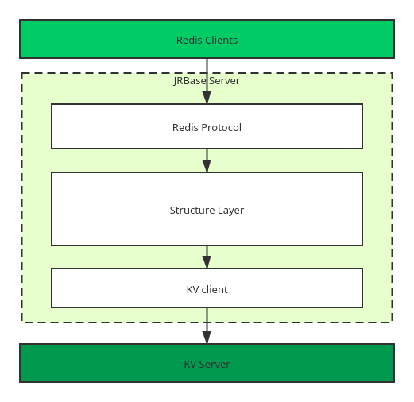

[](https://travis-ci.org/jrbase/jrbase)

[](https://circleci.com/gh/jrbase/jrbase)
## What is jrbase?

jrbase is a Distributed NoSQL database like redis.

jrbase implement redis server protocol, powered by [jraft-rheakv](https://github.com/sofastack/sofa-jraft/tree/master/jraft-rheakv) backend.

## Architecture


### plan supported commands

```
Strings
+-----------+-----------------------+-------------------------------------
|  command  |     supported         |        format                         
|           | (Y=yes,N=no, D=doing) |                               
+-----------+----------------+------+-------------------------------------
|    get    |           Y           |     get key         
+-----------+-----------------------+-------------------------------------
|    set    |           Y           | set key value [EX sec|PX ms][NX|XX]                     
+-----------+-----------------------+------------------------------------
|    mget   |           Y           | mget key1 key2 ...                 
+-----------+-----------------------+------------------------------------
|    mset   |           Y           | mset key1 value1 key2 value2 ...    
+-----------+-----------------------+-------------------------------------
|   getbit  |           Y           | getbit key offset                      
+-----------+-----------------------+-------------------------------------
|   setbit  |           Y           | setbit key offset value             
+-----------+-----------------------+-------------------------------------
|    del    |                       | del key1 key2 ...                   
+-----------+-----------------------+-------------------------------------
|    incr   |                       | incr key                            
+-----------+-----------------------+-------------------------------------
|   incrby  |                       | incr key step                       
+-----------+-----------------------+-------------------------------------
|    decr   |                       | decr key                            
+-----------+-----------------------+-------------------------------------
|   decrby  |                       | decrby key step                     
+-----------+-----------------------+-------------------------------------
|   strlen  |                       | strlen key                          
+-----------+-----------------------+-------------------------------------
|  pexpire  |                       | pexpire key int                     
+-----------+-----------------------+-------------------------------------
| pexpireat |                       | pexpireat key timestamp(ms)         
+-----------+-----------------------+-------------------------------------
|   expire  |                       | expire key int                      
+-----------+-----------------------+-------------------------------------
|  expireat |                       | expireat key timestamp(s)           
+-----------+-----------------------+-------------------------------------
|    pttl   |                       | pttl key                            
+-----------+-----------------------+-------------------------------------
|    ttl    |                       | ttl key                             
+-----------+-----------------------+-------------------------------------


Hashes
+-----------+--------------------------+-----------------------+-------------------------
|  command  |    supported            |               format                          
|           |(Y=yes,N=no, D=doing)    |                                               
+-----------+-------------------------+-------------------------------------------------
|    hset   |         Y               | hset key field1 value1 field2 value2 ...         
+-----------+-------------------------+-------------------------------------------------
|    hget   |         Y               | hget key field1|field2|...                    
+-----------+-------------------------+-------------------------------------------------
|    hlen   |         Y               | hlen key                   
+-----------+-------------------------+-------------------------------------------------


Lists
+------------+-------------------------+-----------------------+-------------------------
|  command   |      supported          |               format                          
|            |  (Y=yes,N=no, D=doing)  |                                               
+------------+-------------------------+-------------------------------------------------
|    lpush   |         Y               | lpush key value1 value2 value3...      
+------------+-------------------------+-------------------------------------------------
|    rpush   |         Y               | rpush key value1 value2 value3...                     
+------------+-------------------------+-------------------------------------------------
|    lpop    |         Y               |  lpop key                 
+------------+-------------------------+-------------------------------------------------
|    rpop    |         Y               |  rpop key                 
+------------+-------------------------+-------------------------------------------------
|   lrange   |         Y               |  lrange key start stop                 
+------------+-------------------------+-------------------------------------------------
|   lindex   |                         |                   
+------------+-------------------------+-------------------------------------------------
|  rpoplpush |                         |                   
+------------+-------------------------+-------------------------------------------------
|  ltrim     |                         |                   
+------------+-------------------------+-------------------------------------------------
|   blpop    |                         |                   
+------------+-------------------------+-------------------------------------------------
| brpoplpush |                         |                   
+------------+-------------------------+-------------------------------------------------


Sets
Sorted Sets
+-------------+------------------------+-----------------------+-------------------------
|  command    |    supported            |               format                          
|             |(Y=yes,N=no, D=doing)    |                                               
+-------------+-------------------------+-------------------------------------------------
|    sadd     |           D             | sadd key member [member ...]        
+-------------+-------------------------+-------------------------------------------------
|    spop     |                         | spop key [count]                  
+-------------+-------------------------+-------------------------------------------------
|  scard      |                         | hget key                   
+-------------+-------------------------+-------------------------------------------------
| smembers    |                         | smembers key                   
+-------------+-------------------------+-------------------------------------------------
| sismember   |                         | sismembers key mmember      
+-------------+-------------------------+-------------------------------------------------
|srandmember  |                         | srandmembers key [count]                  
+-------------+-------------------------+-------------------------------------------------
|   sdiff     |                         | sdiff key [key ...]                
+-------------+-------------------------+-------------------------------------------------


Keys
+-------------+------------------------+-----------------------+-------------------------
|  command    |    supported            |               format                          
|             |(Y=yes,N=no, D=doing)    |                                               
+-------------+-------------------------+-------------------------------------------------
|   del       |                         |     del key              
+-------------+-------------------------+-------------------------------------------------
|   type      |                         |     type key              
+-------------+-------------------------+-------------------------------------------------


Geo
+-------------+-------------------------+-----------------------+-------------------------
|  command    |    supported            |               format                          
|             |(Y=yes,N=no, D=doing)    |                                               
+-------------+-------------------------+-------------------------------------------------
|   geoadd    |                         | geoadd key longitude latitude member [longitude latitude member ...]        
+-------------+-------------------------+-------------------------------------------------
|   geopos    |                         | geopos key  member [member ...]            
+-------------+-------------------------+-------------------------------------------------
|   geodist   |                         | geodist key member1 member2 [m|km|ft|mi]         
+-------------+-------------------------+-------------------------------------------------
|   geohash   |                         | geohash key member [member ...]       
+-------------+-------------------------+-------------------------------------------------
| georadius   |                         | georadius key longitude latitude radius m|km|ft|mi [WITHCOORD] [WITHDIST] [WITHHASH] [COUNT count] [ASC|DESC] [STORE key] [STOREDIST key]         
+-------------+-------------------------+-------------------------------------------------
|georadiusbymember|                     | georadiusbymember key member radius m|km|ft|mi [WITHCOORD] [WITHDIST] [WITHHASH] [COUNT count] [ASC|DESC] [STORE key] [STOREDIST key]
+-------------+-------------------------+-------------------------------------------------


Keys
+-------------+-------------------------+-----------------------+-------------------------
|  command    |    supported            |               format                          
|             |(Y=yes,N=no, D=doing)    |                                               
+-------------+-------------------------+-------------------------------------------------
|   del       |                         |     del key [key ...]             
+-------------+-------------------------+-------------------------------------------------
|   type      |                         |     type key              
+-------------+-------------------------+-------------------------------------------------
|   exists    |                         |     exists key [key ...]           
+-------------+-------------------------+-------------------------------------------------
|   keys      |                         |     keys pattern           
+-------------+-------------------------+-------------------------------------------------


connection
+-------------+-------------------------+-----------------------+-------------------------
|  command    |    supported            |               format                          
|             |(Y=yes,N=no, D=doing)    |                                               
+-------------+-------------------------+-------------------------------------------------
|   auth      |          D              |     auth password             
+-------------+-------------------------+-------------------------------------------------
|   echo      |                         |     echo message       | Bulk string reply     
+-------------+-------------------------+-------------------------------------------------
|   ping      |           Y             |     ping [message]             
+-------------+-------------------------+-------------------------------------------------
|   quit      |                         |     quit           
+-------------+-------------------------+-------------------------------------------------
|   select    |                         |     select index          
+-------------+-------------------------+-------------------------------------------------
|   swapdb    |                         |     swapdb index1 index2            
+-------------+-------------------------+-------------------------------------------------


Server
+-------------+-------------------------+---------------------------------+-------------------------
|  command    |    supported            |               format            |              
|             |(Y=yes,N=no, D=doing)    |                                 |    return value         
+-------------+-------------------------+-------------------------------------------------
|   flushall  |                         |     flushall [async]            |  Simple string reply
+-------------+-------------------------+-------------------------------------------------
|   flushdb  |                         |     flushdb [async]            |  Simple string reply
+-------------+-------------------------+-------------------------------------------------
|   info      |                         |     info [section]              |  Bulk string reply
+-------------+-------------------------+-------------------------------------------------
|   command   |                         |     command           
+-------------+-------------------------+-------------------------------------------------
|   command   |                         |     command  count         
+-------------+-------------------------+-------------------------------------------------


Transactions
Streams
Cluster
HyperLogLog
Pub/Sub
Scripting


```
## Architecture


## Others

[use tikv to build distrubuted redis service](https://pingcap.com/blog-cn/use-tikv-to-build-distributed-redis-service/)
